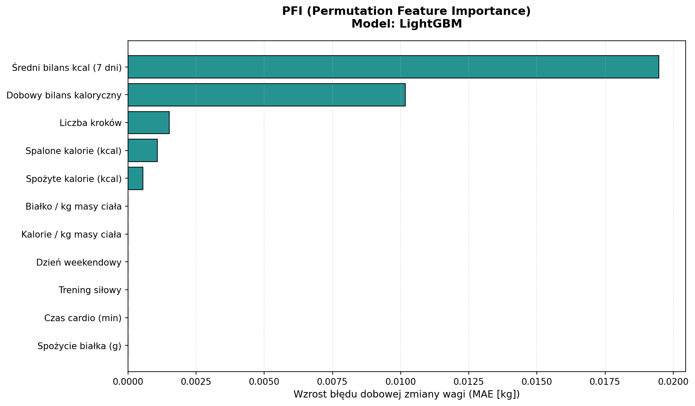
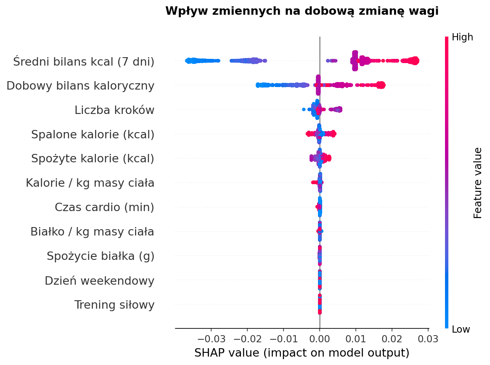
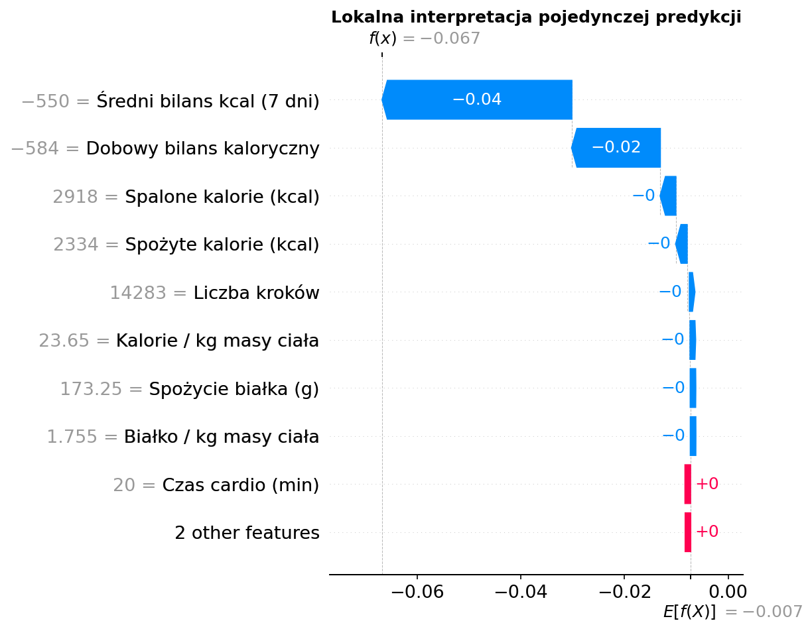
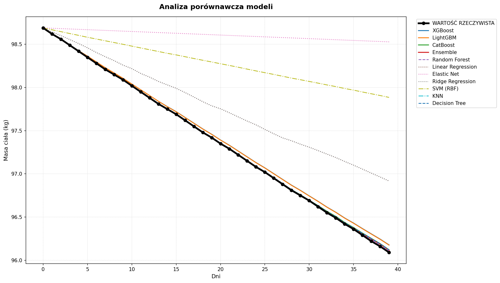

<div align="right">
  <strong>Polski</strong> | <a href="./README.en.md">English</a>
</div>

# FitForm: Dynamika zmian masy ciała w szeregach czasowych i silnik analityki predykcyjnej


Moduł analityczno-predykcyjny dla platformy FitForm, przekształcający codzienne dzienniki aktywności i diety w wiarygodne prognozy zmian masy ciała. Projekt rozwiązuje problem nieregularnych wpisów i dobowych wahań wagi, dostarczając silnikowi rekomendacji aplikacji rzetelne wskaźniki decyzyjne oparte na benchmarkingu 10 modeli regresyjnych oraz analizie ważności cech.
> *Projekt zrealizowany w ramach zespołowego projektu akademickiego Project-Based Learning (PjBL).*


## 1. Problem biznesowy

W aplikacjach fitnessowych standardowe prognozowanie masy ciała wyłącznie na bazie sztywnego deficytu kalorycznego (np. wzór Wishnofsky'ego) zawodzi w kontakcie z rzeczywistym użytkownikiem:
* **Krótkoterminowe wahania wody:** Masa ciała z dnia na dzień potrafi zmienić się o 1-2 kg pod wpływem diety czy regeneracji po treningu, co nie odzwierciedla faktycznej utraty lub przyrostu tkanki tłuszczowej.
* **Nieregularność logowania:** Użytkownicy ważą się nieregularnie (co 2-4 dni), podczas gdy dane dietetyczne i kroki wprowadzają codziennie.
* **Błędy wprowadzania danych:** Skrajne, omyłkowe wpisy manualne zaburzają klasyczne algorytmy uczące.

  
**Rozwiązanie biznesowe:**  
W ramach projektu opracowałam potok predykcyjny (`train_pipeline.py`), który radzi sobie z nieregularnymi pomiarami, wygładza wahania średnimi kroczącymi i prognozuje rzeczywisty trend masy ciała. Wygenerowana prognoza trafia bezpośrednio do silnika aplikacji, który przy użyciu wizualizacji przedstawia predykcje zmiany wagi w wybranym okresie, dopasowuje cel sylwetkowy użytkownika (**redukcja / masa / utrzymanie**) oraz odpowiedni plan treningowy.

<br>

## 2. Schemat przepływu danych (Pipeline Workflow)

```text
Pobranie danych z bazy PostgreSQL
       ↓
Czyszczenie danych i filtracja anomalii (percentyle 5-95%)
       ↓
Inżynieria cech (okna kroczące, wskaźniki per kg masy)
       ↓
Normalizacja zmiennej docelowej do interwałów czasowych (kg/dzień)
       ↓
Podział danych i walidacja GroupKFold (ochrona przed wyciekiem danych)
       ↓
Trening i benchmarking 10 modeli regresyjnych + Ensemble
       ↓
Symulacja scenariuszowa i test stabilności
       ↓
Analiza wyjaśnialności modeli (PFI, SHAP, wykres dopasowania w czasie)
       ↓
Eksport wytrenowanego modelu produkcyjnego (.pkl) dla API backendu


```
<br>


## 3. Dane i przygotowanie zbioru

Dane wykorzystane do przeprowadzania analizy i treningu modeli pochodzą z relacyjnej bazy PostgreSQL (zasilanej procesami ETL) i obejmują dobowe wpisy makroskładników, bilansu kalorycznego, liczby kroków oraz aktywności treningowych.


#### Zbiór łączy dwa źródła danych:
* **Dane empiryczne (5 rzeczywistych użytkowników):** 3-miesięczna historia codziennych wpisów od żywych osób, odzwierciedlające naturalne, nieregularne nawyki, błędy pomiarowe oraz rzeczywiste zmiany masy ciała.
* **Dane syntetyczne (Faker):** Ustrukturyzowana kohorta wygenerowana według dedykowanego schematu symulującego zróżnicowane zachowania - od profili wzorcowych (wysoka regularność, stabilny deficyt/nadwyżka) po przypadki skrajne (duża nieregularność ważeń, epizodyczne skoki kaloryczne, skrajne poziomy aktywności, choroby).
  

---

### 1) Czyszczenie i przygotowanie danych (Data Cleaning)
* **Uzupełnienie brakujących ważeń:** Nieregularne ważenie obsłużono per użytkownik metodami (`ffill` oraz `bfill`), zapewniając ciągłość bazy pomiarowej do dalszych wyliczeń.
* **Usunięcie niepełnych wpisów:** Ostatni zarejestrowany wpis każdego profilu został usunięty ze zbioru uczącego, ponieważ nie posiadał kolejnego pomiaru do wyliczenia dobowej zmiany wagi.
* **Usunięcie błędów i pomyłek:** Jeśli w danych pojawiło się zero (np. brak spalonych kalorii powodujący błąd dzielenia), zamieniono je na puste pole zamiast błędu programu. Dodatkowo odrzucono skrajne 5% największych spadków i wzrostów wagi (percentyle 5% i 95%), eliminując ewidentne pomyłki manualne.


---

### 2) Inżynieria cech (Feature Engineering)
* **Kluczowy bilans energetyczny:** Podstawowa zmienna różnicowa definiująca dobowy deficyt lub nadwyżkę:

$$\text{bilans\_kcal} = \text{spozyte\_kcal} - \text{spalone\_kcal}$$

* **Wyrównanie nieregularnych interwałów:** Zmienna docelowa (y) to znormalizowana dobowa stopa zmiany wagi, uwzględniająca rzeczywisty odstęp czasu między pomiarami:


$$\text{dobowa zmiana wagi [kg/dzień]} = \frac{\Delta \text{waga [kg]}}{\text{dni między ważeniami}}$$


* **Wygładzanie skoków wagi:** Wyliczono średnie z ostatnich 7 dni dla bilansu kalorycznego (`bilans_kcal_ma7`), dzięki czemu model widzi ogólny kierunek zmian, a nie przypadkowe wahania z pojedynczego dnia.
* **Wskaźniki w przeliczeniu na masę ciała:** Zamiast samych kalorii i gramów białka, dodano wartości w przeliczeniu na 1 kg masy ciała (`kcal_na_kg`, `bialko_na_kg`), co pozwala porównywać osoby o różnej wadze.
* **Wpływ weekendów:** Dodano znacznika weekendowego (sobota-niedziela), aby uwzględnić częstsze odstępstwa od diety i zmiany w aktywności w dni wolne.

<br>

---


### 3) Zestaw zmiennych wejściowych (11 cech)
Do modeli przekazano 11 zmiennych podzielonych na 3 kluczowe obszary:
* **Energia i bilans:** dobowy bilans kcal, 7-dniowa średnia bilansu kcal, spożyte kalorie, spalone kalorie, kalorie na kg masy ciała.
* **Odżywianie:** spożycie białka (g) oraz białko na kg masy ciała.
* **Aktywność i styl życia:** trening siłowy (0/1), czas cardio (min), liczba kroków oraz flaga weekendu (0/1).

<br>

---

### 4) Metodyka podziału i walidacji (Zero Data Leakage)
Losowy podział zbioru (`train_test_split`) na danych czasowych użytkowników może prowadzić do wycieku danych - model uczy się na pamięć cech konkretnej osoby. Zastosowano dwustopniowe zabezpieczenie:
1. **Podział profili (80/20) i dane empiryczne:** 80% profili użytkowników trafiło do zbioru treningowego, a 20% stanowi całkowicie odizolowany zbiór testowy. Zagwarantowano obecność profili osób rzeczywistych (`user_id 1-5`) w obu częściach, zapobiegając przeuczeniu modelu wyłącznie na syntetycznych wzorcach.
2. **GroupKFold Cross-Validation:** Walidacja krzyżowa (3 foldy) grupowana ściśle po `user_id`. Modele były sprawdzane wyłącznie na całych profilach użytkowników, których nie widziały w trakcie treningu.

<br>


## 4. Wyniki analizy i modele

### Porównanie 10 modeli regresyjnych
Przetestowano 10 zróżnicowanych algorytmów uczenia maszynowego - od modeli liniowych, przez algorytmy oparte na sąsiedztwie (KNN) i maszynach wektorów nośnych (SVM), aż po metody boostingowe i dedykowany model Ensemble (`VotingRegressor`).
<br>

| Model | MAE mean CV [kg] | RMSE mean CV [kg] | R² mean CV | Test MAE [kg] | Test RMSE [kg] | Test R² |
| :--- | :---: | :---: | :---: | :---: | :---: | :---: |
| **LightGBM** | **0.0026** | **0.0049** | **0.9768** | **0.0022** | **0.0033** | **0.9899** |
| **Ensemble (Voting)** | **0.0026** | **0.0046** | **0.9796** | **0.0021** | **0.0033** | **0.9900** |
| **Random Forest** | 0.0024 | 0.0044 | 0.9818 | 0.0021 | 0.0033 | 0.9898 |
| **XGBoost** | 0.0026 | 0.0050 | 0.9756 | 0.0021 | 0.0033 | 0.9900 |
| **Decision Tree** | 0.0026 | 0.0053 | 0.9721 | 0.0020 | 0.0033 | 0.9896 |
| **CatBoost** | 0.0027 | 0.0046 | 0.9804 | 0.0023 | 0.0034 | 0.9892 |
| **KNN** | 0.0035 | 0.0062 | 0.9617 | 0.0030 | 0.0050 | 0.9769 |
| **Linear Regression** | 0.0112 | 0.0166 | 0.7458 | 0.0114 | 0.0156 | 0.7697 |
| **Ridge Regression** | 0.0112 | 0.0166 | 0.7459 | 0.0114 | 0.0156 | 0.7699 |
| **SVM (RBF)** | 0.0242 | 0.0283 | 0.2790 | 0.0227 | 0.0270 | 0.3103 |
| **Elastic Net** | 0.0273 | 0.0341 | -0.0450 | 0.0252 | 0.0326 | -0.0041 |

*[Pełen zestawienie metryk: static/models_comparison.csv](static/models_comparison.csv)*


> **Komentarz metodyczny do uzyskanych metryk ($R^2 ≈ 0.99$, MAE ≈ 0.002$ kg):**  
> Wyjątkowo wysokie dopasowanie modeli wynika z dominującego udziału danych syntetycznych (95%), generowanych biblioteką Faker w oparciu o reguły bilansu energetycznego. Dane empiryczne stanowiły 5% wolumenu, lecz zadbano o ich reprezentację w odizolowanym zbiorze testowym. Na zbiorze w pełni empirycznym metryki te będą naturalnie niższe. Model w obecnej formie doskonale nauczył się bazowych zależności fizjologicznych, stanowiąc stabilny silnik do symulacji scenariuszowych.

<br>

### Wnioski z tabeli

* **Przewaga modeli gradientowych:** **LightGBM** oraz **Ensemble** bezbłędnie wychwytują nieliniowe interakcje między intensywnością treningu, liczbą kroków a deficytem kalorycznym ($R^2 ≈ 0.99$).
* **Ograniczenia modeli liniowych:** Klasyczna regresja liniowa i Ridge osiągnęły $R^2 ≈ 0.77$. Choć oddają ogólny trend, nie radzą sobie z dobowymi wahaniami i nieliniowymi progami metabolicznymi.
* **Błędny wybór SVM i Elastic Net** Modele te zbyt mocno wygładziły dane ($R^2 <= 0.31$). W efekcie przestały reagować na codzienne zmiany diety i aktywności, przez co ich prognozy były bezużyteczne w symulatorze.
* **Decyzja wdrożeniowa (Dlaczego LightGBM?):**  
    Pomimo że różnice w wynikach były marginalne, LightGBM został wybrany ze względu na **prostotę i efektywność**: w przeciwieństwie do Ensemble nie wymaga łączenia trzech różnych modeli naraz, a od XGBoosta jest lżejszy i stabilniejszy w utrzymaniu bez utraty precyzji.

<br>

## Symulacja scenariuszowa

Zaimplementowano funkcję symulacji krokowej (`symulacja_wagi`), która testuje stabilność modeli w 30-dniowym horyzoncie czasowym przy zadanym scenariuszu (np. waga początkowa 85 kg, deficyt kaloryczny, 14 000 kroków, trening siłowy):
* **Weryfikacja kumulacji błędów:** Sprawdzono, czy w iteracyjnym prognozowaniu dzień po dniu modele nie generują nierealistycznych odchyleń metabolicznych.
* **Wartość:** Mechanizm ten stanowi podstawę modułu symulatora w aplikacji FitForm, umożliwiając użytkownikowi podejrzenie prognozowanego efektu sylwetkowego przed podjęciem planu treningowego.

<br>


## 5. Wyjaśnialność modeli i wizualizacja wpływu cech


#### PFI (Permutation Feature Importance )

Bezpośredni spadek jakości modelu (wzrost błędu MAE) po losowym zaburzeniu wartości danej cechy:





>**Wniosek:**
>Bieżący bilans kaloryczny oraz 7-dniowa średnia krocząca bilansu determinują ponad 80% stabilności predykcji.


<br>


#### SHAP (Shapley Additive Explanations)

* **Globalny wpływ cech (Summary Plot):**  
  Analiza wartości Shapleya pozwala zidentyfikować hierarchię czynników decyzyjnych modelu:

<p align="center">
  
</p>

> **Kluczowe wnioski analityczne (Summary Plot):**
> * **Dominacja bilansu kalorycznego:** Decydujący wpływ na spadek lub wzrost wagi ma 7-dniowy średni bilans oraz bieżący bilans dobowy. Nadwyżka kaloryczna (czerwone punkty po prawej) silnie zwiększa prognozę wagi.
> * **Rola aktywności fizycznej:** Liczba kroków oraz czas cardio systematycznie stymulują spadek masy ciała (wartości niebieskie i przesunięcie w lewo), amortyzując dobowe nadwyżki energetyczne.

<br>

* **Lokalna dekompozycja dnia (Waterfall Plot):**  
  Rozbicie pojedynczej decyzji predykcyjnej dla wybranego dnia - wyjaśnienie, które zachowania zaważyły na spadku lub wzroście wagi względem średniej bazy:

<p align="center">
  
</p>

> **Interpretacja pojedynczej predykcji (Waterfall Plot):**
> * **Kluczowy wpływ deficytu:** Potwierdzając wnioski globalne, w analizowanym dniu to ujemny bilans z ostatnich 7 dni oraz deficyt bieżący zaważyły na obniżeniu prognozy o blisko 0.05 kg/dzień.
> * **Wartość produktowa dla FitForm:** Taka dekompozycja pozwala aplikacji wygenerować dla użytkownika przejrzysty komunikat w panelu dziennym: „Twój prognozowany spadek wagi wynika w przeważającej mierze z utrzymywanego deficytu z ostatnich 7 dni, a nie tylko z dzisiejszego treningu”.

<br>

#### Dopasowanie w czasie

Weryfikacja dobowych predykcji na osi czasu względem danych rzeczywistych dla profilu o największej dynamice zmian:
<br>



> **Komentarz do wykresu:** Wykres przedstawia 40-dniową symulację krokową. Podczas gdy modele drzewiaste (LightGBM, XGBoost) bezbłędnie utrzymały zadany trend metaboliczny bez efektu dryfu, silnie regularyzowane modele liniowe (Elastic Net) wykazały niedouczenie (underfitting), tłumiąc dobową dynamikę zmian.

<br>

## 6. Użyte technologie

* **Język i biblioteki bazowe:** Python, Pandas, NumPy
* **Baza danych i backend:** PostgreSQL / Supabase, SQLAlchemy
* **Machine Learning:** LightGBM, XGBoost, CatBoost, Scikit-learn
* **Interpretowalność i wizualizacja:** SHAP, Matplotlib

  
<br>


## 7. Architektura modułu

```text
fitform-predictive-analytics/
├── static/
│   ├── models_comparison.csv             # Wyeksportowana tabela metryk modeli
│   ├── models_timeline_comparison.png    # Porównanie dopasowania na osi czasu
│   ├── pfi_lightgbm.png                  # Wykres ważności cech PFI
│   ├── shap_summary.png                  # Globalny wpływ cech (SHAP Summary)
│   └── shap_waterfall.png                # Dekompozycja pojedynczej predykcji (SHAP)
├── .env.example                          # Szablon zmiennych środowiskowych bazy
├── .gitignore                            # Wykluczenia plików tymczasowych i wrażliwych
├── README.md                             # Dokumentacja modułu
├── requirements.txt                      # Zależności biblioteczne potoku
└── train_pipeline.py                     # Potok analityczno-predykcyjny end-to-end
```
<br>

## 8. Jak uruchomić projekt

Sklonuj repozytorium:

```bash
git clone https://github.com/twoja-nazwa-uzytkownika/fitform-predictive-analytics.git
```
Zainstaluj wymagane pakiety:
```bash
pip install -r requirements.txt
```
Skonfiguruj plik ze zmiennymi środowiskowymi:
```bash
cp .env.example .env
```
Uruchom skrypt w Pythonie:
```bash
python train_pipeline.py
```

<br>


## 9. Kierunki dalszego rozwoju

Możliwe rozszerzenia modułu obejmują:

* Integracja z zewnętrznymi API opasek sportowych (Apple Health, Google Fit) w celu automatycznego pobierania tętna i wydatku energetycznego
* Przetestowanie architektur sekwencyjnych (LSTM / GRU) dla dłuższych horyzontów czasowych
* Zbudowanie interaktywnego dashboardu analitycznego do śledzenia predykcji

<br>

## 10. Kluczowe wnioski

Wykorzystując **11 kluczowych wskaźników dobowych**, model **LightGBM** precyzyjnie prognozuje rzeczywisty trend masy ciała (**$R^2 ≈ 0.99$**, **MAE ≈ 0.002 kg/dzień**), skutecznie filtrując dobowy szum wywołany naturalnymi zmianami i nieregularnym ważeniem.

Prognozy modelu wspierają silnik decyzyjny aplikacji FitForm w:

* Automatycznym dopasowywaniu celów sylwetkowych (redukcja, masa, utrzymanie)
* Dynamicznej korekcie planów treningowych i kalorycznych na bazie rzeczywistych postępów
* Wczesnym wykrywaniu stagnacji metabolicznej i spadku motywacji użytkownika
* Dostarczaniu użytkownikom przejrzystych wyjaśnień (XAI), które czynniki najbardziej wpływają na ich wagę

Projekt prezentuje kompletny proces Data Science / Analytics: od ekstrakcji danych z relacyjnej bazy PostgreSQL, przez zaawansowany preprocessing i inżynierię cech szeregów czasowych, benchmarking 10 architektur modeli z walidacją `GroupKFold`, aż po wyjaśnialność biznesową (SHAP, PFI).

---
